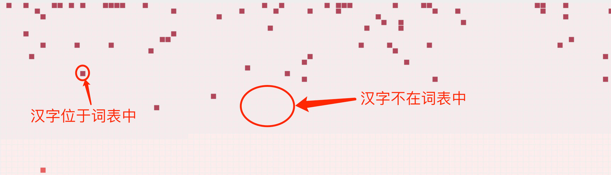
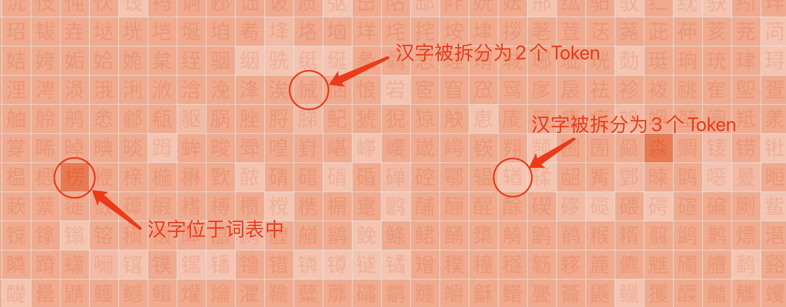
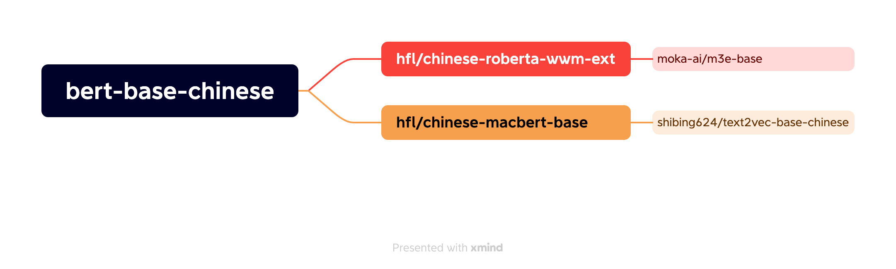
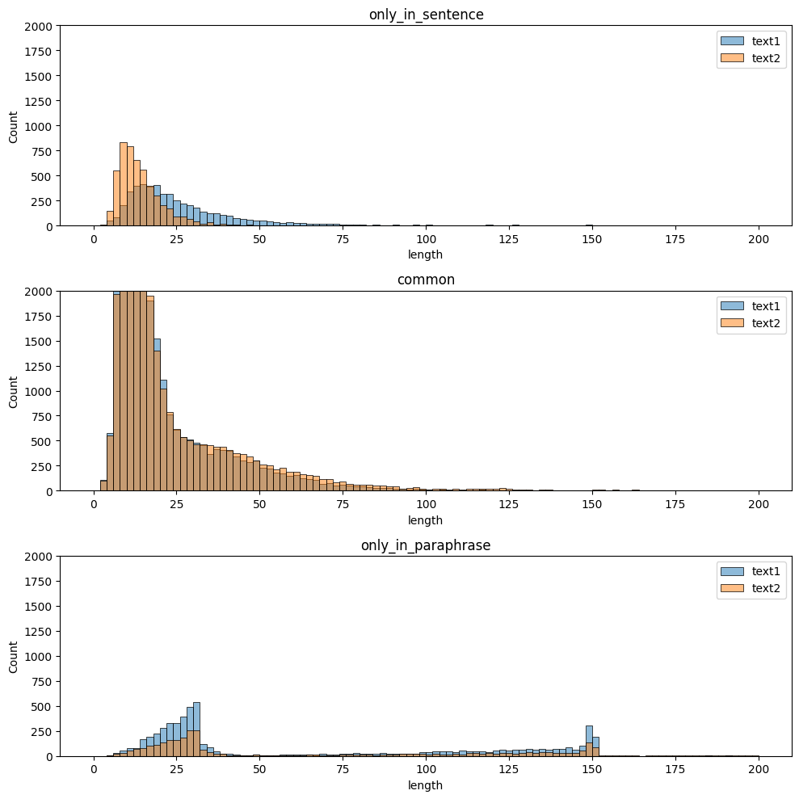

# 语言模型中文认知能力分析

- [语言模型中文认知能力分析](#语言模型中文认知能力分析)
  - [项目介绍](#项目介绍)
    - [中文识字率分析](#中文识字率分析)
      - [字符集](#字符集)
      - [识字判定](#识字判定)
    - [词向量分布分析](#词向量分布分析)
      - [字词的分类](#字词的分类)
        - [语言](#语言)
        - [后缀子词](#后缀子词)
      - [输入端词向量、输出端词向量](#输入端词向量输出端词向量)
  - [分析观察](#分析观察)
    - [BERT 类模型](#bert-类模型)
      - [bert-base-cased](#bert-base-cased)
      - [roberta-large](#roberta-large)
      - [bert-base-multilingual-cased](#bert-base-multilingual-cased)
    - [bert-base-chinese 模型及其衍生的模型对比](#bert-base-chinese-模型及其衍生的模型对比)
    - [ERNIE 模型及其衍生的模型对比](#ernie-模型及其衍生的模型对比)
    - [paraphrase-multilingual-MiniLM-L12-v2 模型及其衍生的模型对比](#paraphrase-multilingual-minilm-l12-v2-模型及其衍生的模型对比)
    - [xlm-roberta-base 模型及其微调后的模型对比](#xlm-roberta-base-模型及其微调后的模型对比)
    - [LLaMA 及衍生模型](#llama-及衍生模型)
    - [英文大语言模型](#英文大语言模型)
    - [中文大语言模型](#中文大语言模型)
    - [OpenAI 提供的模型](#openai-提供的模型)
    - [其他模型](#其他模型)
  - [命令行工具 `vocab-coverage` 使用指南](#命令行工具-vocab-coverage-使用指南)
    - [安装](#安装)
    - [使用](#使用)
      - [`charset` 子命令](#charset-子命令)
      - [`coverage` 子命令](#coverage-子命令)
      - [`embedding` 子命令](#embedding-子命令)

> 跳到 [所有模型的分析图](graphs.md)。

## 项目介绍

本项目的初衷是为了调查各个语言模型的中文认知能力，目前包括**中文识字率分析**、**输入端词向量分布分析**、**输出端词向量分析**。大规模语言模型非常复杂，难以一言以蔽之，只有从多个角度观察，才会得到更全面的认知，本分析是从一个角度一窥语言模型内部机理，并希望可以成为后续模型评估分析的参考。

### 中文识字率分析

为了分析模型的中文识字率，我们使用三个常用的字符集，《通用规范汉字表》、《常用國字標準字體表》以及《Unicode中日韩统一表意文字》，总共`21267`个汉字。

#### 字符集

- [《通用规范汉字表》](https://zh.wikipedia.org/zh-cn/%E9%80%9A%E7%94%A8%E8%A7%84%E8%8C%83%E6%B1%89%E5%AD%97%E8%A1%A8)，由中华人民共和国教育部、国家语言文字工作委员会，于2001年开始研制，并于2013年正式颁布，作为社会一般应用领域的汉字规范。在该字表中，共收录了 **8105** 个汉字，其中一级字表（常用字集）**3500** 个，二级字表 **3000** 个，三级字表 **1605** 个。字表内容从[中文百科](https://www.zwbk2009.com/)中获取。
- [《常用國字標準字體表》](https://zh.wikipedia.org/zh-hant/%E5%B8%B8%E7%94%A8%E5%9C%8B%E5%AD%97%E6%A8%99%E6%BA%96%E5%AD%97%E9%AB%94%E8%A1%A8)，由國立臺灣師範大學于1973年开始研制，并于1982年正式启用，其中常用國字標準字體表（简称甲表），收录常用字 **4808** 个，其中有 **1749** 个汉字不在《通用规范汉字表》中；次常用國字標準字體表（简称乙表），收录次常用字 **6343** 个，其中有 **4503** 个汉字不在《通用规范汉字表》中。统计汉字识字率时，将只针对增加的汉字进行统计，已经在《通用规范汉字表》中的汉字不再重复统计。
- [《Unicode中日韩统一表意文字》](https://zh.wikipedia.org/zh-cn/%E4%B8%AD%E6%97%A5%E9%9F%93%E7%B5%B1%E4%B8%80%E8%A1%A8%E6%84%8F%E6%96%87%E5%AD%97_(Unicode%E5%8D%80%E6%AE%B5))区段，为汉字在 Unicode 中的基本区段。在 1993 年制定，作为 [ISO 10646-1:1993 标准](https://www.iso.org/standard/18741.html)，以及 [Unicode 1.1 规范](http://www.unicode.org/versions/Unicode1.1.0/) 颁布，收录 **20902** 个汉字，后陆续补充，在 Unicode 14.0 时，共收录了 **20992** 个汉字，占满码位 `U+4E00~U+9FFF`。其中有**6910** 个汉字，不在《通用规范汉字表》中，也不在《常用國字標準字體表》中。统计汉字识字率时，将只针对增加的这些汉字进行统计，已经在《通用规范汉字表》和《常用國字標準字體表》中的汉字不在重复统计。汉字在 Unicode 中还有其它区段，截止 2022 年发布的 Unicode 15.0，总共[收录 **97058** 个汉字](https://zh.wikipedia.org/zh-cn/%E4%B8%AD%E6%97%A5%E9%9F%93%E7%B5%B1%E4%B8%80%E8%A1%A8%E6%84%8F%E6%96%87%E5%AD%97#%E7%89%88%E6%9C%AC)，但由于其它汉字不常使用，这里暂不纳入统计范围。

为了能够直观的反应模型对于不同字符集的识字率，我们使用不同的颜色来标识不同字符集的汉字。

|   识字率分析图  |  颜色对应关系 |
|:----------------:|:----------------|
|[](http://syd.lab99.org/vocab-coverage/coverage/OpenAI_text-embedding-ada-002.coverage.jpg) |    深红色：《通用规范汉字表》一级汉字<br>  红　色：《通用规范汉字表》二级汉字<br>  橘黄色：《通用规范汉字表》三级汉字<br>  深蓝色：《常用國字標準字體表》甲表汉字<br>  浅蓝色：《常用國字標準字體表》乙表汉字<br>  粉　色：《Unicode中日韩统一表意文字》区段汉字|


#### 识字判定

如何判断一个模型是否认知某个汉字，要分几个层面来具体分析。

首先，我们要了解模型的 Tokenizer 是如何对汉字进行编码的。

我们使用的模型，从汉字角度来看，Tokenizer 主要有两种编码方式，一种是将一个汉字直接编码成一个 token，如 [WordPiece](https://huggingface.co/learn/nlp-course/chapter6/6?fw=pt)；另一种是如 [BBPE（Byte-level BPE）](https://arxiv.org/abs/1909.03341)的方式，有可能将汉字按照它的 UTF-8 字节码，拆分成多个 token 的。

对于 WordPiece 这类按照字符编码，或者说按照 Unicode 码位编码的情况，如果其 Tokenizer 中的词表(vocab) 中没有对应的汉字，那么这个模型就是完全不认识这个汉字。对应的汉字将被编码为 `unk_token_id`，即词表中的 `[UNK]`。这类模型对于汉字的认知程度，可以用词表中汉字的数量来衡量，存在于词表则计数为 `1`，不存在则计数为 `0`。



而对于可能将一个汉字拆分为多个 token 的 BBPE 这类编码方式，则需要更复杂一些的思考和应对。这类 Tokenizer 如果在训练的过程中，遇到过一些汉字，则可能会在词表中直接包含该汉字，从而产生单一的 token 与之对应；但如果在训练的过程中，没有遇到过某个汉字，或较少的遇到某些汉字，则该汉字将被拆分为多个 token。因此这类模型中，汉字对应的 token 数量，从1个到4个不等。

英文模型中，我们并不是在词表中存储26个字母，而是存储大量能够聚合的单词或子词，是因为一个单词被拆成单一字母，对语义的理解是有伤害的，这种伤害可能会消耗更多层的 Transformer 来弥补。同样的情况，一个汉字词语，或者一个汉字，被拆分成无语义的 UTF-8 字节码，这对于中文语义的理解也必然是有伤害的。因此，在识字判定中，我们将不计入一个汉字对应多个 token 的情况，而只对一个汉字对应单一 token 的情况计数为 `1`。

但是，由于理论上 BBPE 这类 Tokenizer 是可以识别任意字符的，因此我们会在图中，用颜色来表示这种差别。对于词表中存在的汉字，我们用最深的颜色表示；对于一个汉字拆分成多个 token 的情况，拆分的越多，颜色越浅，用以表示其语义的损失程度。



> 在进行判断前，会先行去除前缀后缀的特殊token。

### 词向量分布分析

单纯的观察词表中汉字的数量，以及汉字对应的 token 数量，是不足以充分反应模型对于汉字的认知程度的。

模型对于一个汉字、或者一个汉字词汇的理解，并不因为这些词存在于词表，就天然的理解了其语义。模型需要对词表中的词所对应的词向量进行训练，让词向量具有语义关系。而在空间上的表现，则为相近语义的词向量，在空间上具有临近的关系。

所以，有些模型可能单纯的将很多数汉字加入词表(vocab)，但是这些词的向量却没有被训练出语义，依旧保持着**初始的随机状态**，这种情况下，模型对于这些汉字的认知程度，也是较差的。

为了反应这种认知上的差异，我们对词表中的词，在向量空间的分布进行了分析。我们将词表中的词，计算出词向量，每个词向量就是高维空间中的一个点，然后，我们使用 [t-SNE](https://towardsdatascience.com/t-sne-clearly-explained-d84c537f53a) 对高维空间非线性降维，降维的同时尽量保持原有的空间关系，最终将高维空间中的点，映射到二维平面上，形成一个分布图。这个图中，每个点（*放大后是文字*）代表词表中的一个词，点与点之间的距离远近，代表了词向量之间的距离远近，即语义上的相关程度。我们将这个图，称为「**词向量分布图**」。

#### 字词的分类

模型词表中的词并不一定都是中文字词，还有很多英文以及多语言字词，以及一些数字、符号。为了可以更好的观察不同的词向量分布，我们将词表中的词进行了分类，区分显示「中文」、「英文」、「日文」、「韩文」、「数字」和「其他」，并进行分色显示。

##### 语言

由于本分析的重点在于中文认知能力的分析，因此我们将汉字进一步分为了「**常用字**」和「**生僻字**」两类。其中，常用字为属于《通用规范汉字表》一级和二级汉字，以及《常用國字標準字體表》甲表新增汉字；生僻字则为属于《通用规范汉字表》三级汉字，以及《常用國字標準字體表》乙表新增汉字和《Unicode中日韩统一表意文字》中的新增汉字。

「日文」是指日语中的[平假名](https://zh.wikipedia.org/zh-hans/%E5%B9%B3%E5%81%87%E5%90%8D)和[片假名](https://zh.wikipedia.org/zh-hans/%E7%89%87%E5%81%87%E5%90%8D)，「韩文」是指韩语中的[谚文](https://zh.wikipedia.org/zh-cn/%E8%AB%BA%E6%96%87)。「英文」则包括了除中日韩文之外，包括英文在内的各种拉丁语言文字等。只包含 `0-9` 的词视为「数字」，其余的词视为「其他」。

| 词向量分布图 | 颜色对应关系 |
| ------------ | ------------ |
| [](http://syd.lab99.org/vocab-coverage/embeddings/shibing624_text2vec-base-chinese-sentence.embeddings.input.jpg) |   汉字（常用字）<br>  汉字（生僻字）<br>  日文<br>  韩文<br>  英文<br>  数字<br>  其他<br> |

##### 后缀子词

除了文字类别外，词表中的词还有普通词和后缀的区别，如，「**dragon**」和「**##fly**」，「**dragon**」为普通词，「**##fly**」是一个后缀子词，可以跟「**dragon**」组合为「**dragonfly**」。

英文这种设计是为了避免词表太大，从而将词划分为子词，多个子词(subwords)组成一个词(word)，通过组合方式降低词表词汇量，在同等词汇量的情况下，支持更多词汇。这就像现代汉语中的**多字词**，通过组合既有汉字，避免造字以描述新鲜事物。

但是这种切分方式不一定对中文也适用，中文每个汉字都可能成为所谓后缀子词，而不是简单的修饰后缀，因此可能会有和单字同等规模的相同字的后缀子词出现，从而反而浪费了词表。

为了观察独立的普通词和后缀词的差异，于是，我们将这两种类别的词区分了颜色，「**普通词**」为**本色**，「**后缀**」为**更浅一些**的颜色。

下面的两个模型为例，左边的是英文的 BERT 模型，其中浅绿色的部分点为英文后缀子词；右边的是中文的 BERT 模型，淡粉色的部分点为中文后缀子词。他们的分布特征和普通词截然不同。

| 英文的「普通词」和「后缀词」 | 中文的「普通词」和「后缀词」 |
| ------------ | ------------ |
| [](http://syd.lab99.org/vocab-coverage/embeddings/bert-base-cased.embeddings.input.jpg) | [](http://syd.lab99.org/vocab-coverage/embeddings/bert-base-chinese.embeddings.input.jpg) |

#### 输入端词向量、输出端词向量

对于一个模型而言，每个词所对应的向量其实分为两种情况。一种是在输入时所获得的 [Token Embedding](https://medium.com/@_init_/why-bert-has-3-embedding-layers-and-their-implementation-details-9c261108e28a)；另一种是在最后模型输出时对最后一层 [hidden_state](https://huggingface.co/docs/transformers/main_classes/output#transformers.modeling_outputs.BaseModelOutput.last_hidden_state) 进行[计算](https://medium.com/@gulsum.budakoglu/from-sentencetransformer-transformer-and-pooling-components-7d9ad4fcd70f)得到的 embedding。我们将前者称为「**输入端词向量**」，后者称为「**输出端词向量**」。

| 输入端词向量分布图 | 输出端词向量分布图 |
| ------------ | ------------ |
| [](http://syd.lab99.org/vocab-coverage/embeddings/shibing624_text2vec-base-chinese-sentence.embeddings.input.jpg) | [](http://syd.lab99.org/vocab-coverage/embeddings/shibing624_text2vec-base-chinese-sentence.embeddings.output.jpg) |


前者为词或token进入模型时，经过 embedding 层所得到的最初语义表达；而后者，则是经过模型多层计算之后，最终理解的语义表达。

一般来说，输入端的语义会更加基础，而输出端的语义会更加丰富。从向量分布图来看，输入端将会呈现更小的局部结构，而输出端则会呈现更复杂的局部结构，以及更大规模的全局结构。通过对比输入端词向量和输出端词向量的分布图，我们可以看到模型对于中文认知的变化，以及各种同基座模型不同微调后的变化。从而我们可以对模型于中文认知差异上有个更加直观的认识。


## 分析观察

下面是挑选出来的一些比较有特点的模型，并非完整模型列表，完成列表请查看 [模型分析列表](graphs.md)。

如果图片无法显示，请访问项目 Github 页面：<https://github.com/twang2218/vocab-coverage>


### BERT 类模型

这里对比了比较典型的3个 BERT 类模型。

#### bert-base-cased

| 模型 | 完整性分析 (子词) | 入向量分布 (子词) | 出向量分布 (子词) | 完整性分析 (汉字) | 入向量分布 (汉字) | 出向量分布 (汉字) | 入向量分布 (词语) | 出向量分布 (词语) |
|:---:|:---:|:---:|:---:|:---:|:---:|:---:|:---:|:---:|
| <b>bert-base-cased</b> | [](http://syd.jiefu.org/vocab-coverage/fullsize/bert-base-cased.coverage.token.jpg) | [](http://syd.jiefu.org/vocab-coverage/fullsize/bert-base-cased.embedding.token.input.jpg) | [](http://syd.jiefu.org/vocab-coverage/fullsize/bert-base-cased.embedding.token.output.jpg) | [](http://syd.jiefu.org/vocab-coverage/fullsize/bert-base-cased.coverage.char.jpg) | [](http://syd.jiefu.org/vocab-coverage/fullsize/bert-base-cased.embedding.char.input.jpg) | [](http://syd.jiefu.org/vocab-coverage/fullsize/bert-base-cased.embedding.char.output.jpg) | [](http://syd.jiefu.org/vocab-coverage/fullsize/bert-base-cased.embedding.word.input.jpg) | [](http://syd.jiefu.org/vocab-coverage/fullsize/bert-base-cased.embedding.word.output.jpg) |


`bert-base-cased` 是原始的**英文** BERT 模型，使用的是 **WordPiece** Tokenizer，只使用英文语料训练，因此词表中基本都是英文，只有少数汉字的「漏网之鱼」。这个模型基本**不认识汉字**，绝大多数汉字在输入模型时，会被替换为 `[UNK]`，这样的模型，就算经过微调，也不会对中文有什么认知。

从词向量分布图上看，可以很清晰的看到，**「数字」连成了线条**，并且和英文文字之间保持了一定的距离，这就说明数字之间具有很强的相关的关系，而数字和文字之间有明显的语义区别。

此外，还可以观察到「**普通词**」和「**后缀子词**」可以很好的区分开来，并且如果进一步观察词与词的连结关系，会发现「普通词」之间的连结更复杂，而「后缀子词」之间的连结更简单和稀疏。这说明「普通词」比「后缀子词」更容易被训练出语义。

如果观察输出端词向量分布图，会看到词与词之间的连结关系更加复杂，除了几个词语之间的聚集外，还**出现了更大规模、更复杂的聚集和连结关系**，这应该说明模型在输出端对于词语的语义理解**更加丰富**。

#### roberta-large

| 模型 | 完整性分析 (子词) | 入向量分布 (子词) | 出向量分布 (子词) | 完整性分析 (汉字) | 入向量分布 (汉字) | 出向量分布 (汉字) | 入向量分布 (词语) | 出向量分布 (词语) |
|:---:|:---:|:---:|:---:|:---:|:---:|:---:|:---:|:---:|
| <b>roberta-large</b> | [](http://syd.jiefu.org/vocab-coverage/fullsize/roberta-large.coverage.token.jpg) | [](http://syd.jiefu.org/vocab-coverage/fullsize/roberta-large.embedding.token.input.jpg) | [](http://syd.jiefu.org/vocab-coverage/fullsize/roberta-large.embedding.token.output.jpg) | [](http://syd.jiefu.org/vocab-coverage/fullsize/roberta-large.coverage.char.jpg) | [](http://syd.jiefu.org/vocab-coverage/fullsize/roberta-large.embedding.char.input.jpg) | [](http://syd.jiefu.org/vocab-coverage/fullsize/roberta-large.embedding.char.output.jpg) | [](http://syd.jiefu.org/vocab-coverage/fullsize/roberta-large.embedding.word.input.jpg) | [](http://syd.jiefu.org/vocab-coverage/fullsize/roberta-large.embedding.word.output.jpg) |


此处的 `roberta-large` 就是典型的使用 **BBPE Tokenizer** 的**英文**模型，其词表中**几乎没有汉字**，但由于字节拆分的特征，不管是否对理解力有损伤，**理论上**它是可以接受所有字符的。在它的中文覆盖率的图上，可以看出，基本所有汉字都被拆分为多个 token，甚至绝大多数都被拆分为了 3 个 token。这样的模型，对于中文的认知有限，不仅仅是因为它没有使用中文语料训练，就算使用中文语料训练，如果不扩增词表，可能也会伤害其性能。此外，这个模型的输入端词向量分布图和输出端词向量分布度，也呈现了由简单连结关系，向复杂连结关系发展的变化。

#### bert-base-multilingual-cased
  
| 模型 | 完整性分析 (子词) | 入向量分布 (子词) | 出向量分布 (子词) | 完整性分析 (汉字) | 入向量分布 (汉字) | 出向量分布 (汉字) | 入向量分布 (词语) | 出向量分布 (词语) |
|:---:|:---:|:---:|:---:|:---:|:---:|:---:|:---:|:---:|
| <b>bert-base-multilingual-cased</b> | [](http://syd.jiefu.org/vocab-coverage/fullsize/bert-base-multilingual-cased.coverage.token.jpg) | [](http://syd.jiefu.org/vocab-coverage/fullsize/bert-base-multilingual-cased.embedding.token.input.jpg) | [](http://syd.jiefu.org/vocab-coverage/fullsize/bert-base-multilingual-cased.embedding.token.output.jpg) | [](http://syd.jiefu.org/vocab-coverage/fullsize/bert-base-multilingual-cased.coverage.char.jpg) | [](http://syd.jiefu.org/vocab-coverage/fullsize/bert-base-multilingual-cased.embedding.char.input.jpg) | [](http://syd.jiefu.org/vocab-coverage/fullsize/bert-base-multilingual-cased.embedding.char.output.jpg) | [](http://syd.jiefu.org/vocab-coverage/fullsize/bert-base-multilingual-cased.embedding.word.input.jpg) | [](http://syd.jiefu.org/vocab-coverage/fullsize/bert-base-multilingual-cased.embedding.word.output.jpg) |


`bert-base-multilingual-cased` 则是一个典型的使用了 **WordPiece** 的**多语言模型**，为了支持多国语言，它将词表扩充到了**12万**，并且使用了多国语言的语料进行训练。因此它支持**汉字的常用字，包括简繁体**，但是稍微不常用一些的字，它认知的就非常少了。

观察该模型的输入端词向量分布图和输出端词向量分布图，会发现他们皆呈现出**同一个语言抱团**的现象，最典型的是中文、日文、韩文是独立的三团。绿色的部分实际涵盖了多种语言，在这个模型里，绿色部分语言之间的分界并不明显，放大后是可以看到同一种语言有聚集现象。

此外，输入端词向量分布图中，中文的「**后缀子词**」呈现出随机分布的形态，团成一团，并且互相之间几乎等距，不像汉字「**普通词**」那样，有明显的三五个词连成一线的简单结构。这说明**中文的后缀子词在输入端没有训练出语义**。而如果对比英文后缀子词，则会发现他们有3-5个词的小幅聚集情况，这说明英文的后缀子词在输入端训练出了一定的语义。因此，可能如之前所说的一样，**后缀子词的用法可能并不适合中文**。

观察输出端词向量分布图，会发现，中文后缀子词，开始具有简单的小堆聚集连结的倾向，说明经过了完整的网络后，后缀子词的语义确实有被学习到。但是，这个结构的复杂和清晰程度，远远不如英文后缀子词，观察浅绿色的那部分，可以看到英文中更清晰的聚集结构。这些都有可能说明，**子词（subword）的用法，更适合英文，而不一定适合中文。**

### bert-base-chinese 模型及其衍生的模型对比

| 模型 | 完整性分析 (子词) | 入向量分布 (子词) | 出向量分布 (子词) | 完整性分析 (汉字) | 入向量分布 (汉字) | 出向量分布 (汉字) | 入向量分布 (词语) | 出向量分布 (词语) |
|:---:|:---:|:---:|:---:|:---:|:---:|:---:|:---:|:---:|
| <b>bert-base-chinese</b> | [](http://syd.jiefu.org/vocab-coverage/fullsize/bert-base-chinese.coverage.token.jpg) |   |   | [](http://syd.jiefu.org/vocab-coverage/fullsize/bert-base-chinese.coverage.char.jpg) | [](http://syd.jiefu.org/vocab-coverage/fullsize/bert-base-chinese.embedding.char.input.jpg) | [](http://syd.jiefu.org/vocab-coverage/fullsize/bert-base-chinese.embedding.char.output.jpg) | [](http://syd.jiefu.org/vocab-coverage/fullsize/bert-base-chinese.embedding.word.input.jpg) | [](http://syd.jiefu.org/vocab-coverage/fullsize/bert-base-chinese.embedding.word.output.jpg) |
| <b><p>hfl</p><p>/</p><p>chinese-macbert-base</p></b> | [](http://syd.jiefu.org/vocab-coverage/fullsize/hfl_chinese-macbert-base.coverage.token.jpg) |   |   | [](http://syd.jiefu.org/vocab-coverage/fullsize/hfl_chinese-macbert-base.coverage.char.jpg) | [](http://syd.jiefu.org/vocab-coverage/fullsize/hfl_chinese-macbert-base.embedding.char.input.jpg) | [](http://syd.jiefu.org/vocab-coverage/fullsize/hfl_chinese-macbert-base.embedding.char.output.jpg) | [](http://syd.jiefu.org/vocab-coverage/fullsize/hfl_chinese-macbert-base.embedding.word.input.jpg) | [](http://syd.jiefu.org/vocab-coverage/fullsize/hfl_chinese-macbert-base.embedding.word.output.jpg) |
| <b><p>shibing624</p><p>/</p><p>text2vec-base-chinese</p></b> | [](http://syd.jiefu.org/vocab-coverage/fullsize/shibing624_text2vec-base-chinese.coverage.token.jpg) |   |   | [](http://syd.jiefu.org/vocab-coverage/fullsize/shibing624_text2vec-base-chinese.coverage.char.jpg) | [](http://syd.jiefu.org/vocab-coverage/fullsize/shibing624_text2vec-base-chinese.embedding.char.input.jpg) | [](http://syd.jiefu.org/vocab-coverage/fullsize/shibing624_text2vec-base-chinese.embedding.char.output.jpg) | [](http://syd.jiefu.org/vocab-coverage/fullsize/shibing624_text2vec-base-chinese.embedding.word.input.jpg) | [](http://syd.jiefu.org/vocab-coverage/fullsize/shibing624_text2vec-base-chinese.embedding.word.output.jpg) |
| <b><p>moka-ai</p><p>/</p><p>m3e-base</p></b> | [](http://syd.jiefu.org/vocab-coverage/fullsize/moka-ai_m3e-base.coverage.token.jpg) |   |   | [](http://syd.jiefu.org/vocab-coverage/fullsize/moka-ai_m3e-base.coverage.char.jpg) | [](http://syd.jiefu.org/vocab-coverage/fullsize/moka-ai_m3e-base.embedding.char.input.jpg) | [](http://syd.jiefu.org/vocab-coverage/fullsize/moka-ai_m3e-base.embedding.char.output.jpg) | [](http://syd.jiefu.org/vocab-coverage/fullsize/moka-ai_m3e-base.embedding.word.input.jpg) | [](http://syd.jiefu.org/vocab-coverage/fullsize/moka-ai_m3e-base.embedding.word.output.jpg) |
| <b><p>junnyu</p><p>/</p><p>wobert_chinese_plus_base</p></b> | [](http://syd.jiefu.org/vocab-coverage/fullsize/junnyu_wobert_chinese_plus_base.coverage.token.jpg) |   |   | [](http://syd.jiefu.org/vocab-coverage/fullsize/junnyu_wobert_chinese_plus_base.coverage.char.jpg) | [](http://syd.jiefu.org/vocab-coverage/fullsize/junnyu_wobert_chinese_plus_base.embedding.char.input.jpg) | [](http://syd.jiefu.org/vocab-coverage/fullsize/junnyu_wobert_chinese_plus_base.embedding.char.output.jpg) | [](http://syd.jiefu.org/vocab-coverage/fullsize/junnyu_wobert_chinese_plus_base.embedding.word.input.jpg) | [](http://syd.jiefu.org/vocab-coverage/fullsize/junnyu_wobert_chinese_plus_base.embedding.word.output.jpg) |


这几个模型都是具有继承关系的，均是在前一个模型的基础上，调整了训练方法，用了更多的语料进行了训练，其继承关系如下：



因此我们可以看到这几个模型的中文识字率的结果是完全一样的。

在输入端词向量分布图上，我们可以看到只有最原始的 `bert-base-chinese` 外形最不一样，其他三个都几乎一致。最明显的是「中文后缀子词」部分，`hfl` 及其之后的模型，明显更有一些语义被训练出来，而原始的 `bert-base-chinese` 则基本保持初始化的均匀分布。

这恐怕是因为其中最大的变动是 `hfl` 的两个模型，均使用了同样的 **5.4B tokens** 的语料进行了训练，远超原版的 **0.4B tokens** 的语料，而后续模型的微调则都没有再用这么大的数据集训练了，所以这应该是引起输入端词向量变化的最主要因素。

当我们看向输出端词向量，则会发现每个模型的分布都截然不同。除了 `moka-ai/m3e-base` 外的三个模型，「普通词」和「后缀子词」都是明确分开的；而 `moka-ai/m3e-base` 却出现了 **「普通词」和「后缀子词」混合在一起** 的情况，甚至进一步放大去看，会发现，**同一个汉字的「普通词」和「后缀子词」基本重叠**，也就是二者对齐了。

由此可见，**微调对于输出端词向量的影响，远大于对输入端词向量的影响**。那么或许可以通过观察输出端的词向量分布变化，来观察不同的训练语料对于模型的影响。
### ERNIE 模型及其衍生的模型对比

| 模型 | 完整性分析 (子词) | 入向量分布 (子词) | 出向量分布 (子词) | 完整性分析 (汉字) | 入向量分布 (汉字) | 出向量分布 (汉字) | 入向量分布 (词语) | 出向量分布 (词语) |
|:---:|:---:|:---:|:---:|:---:|:---:|:---:|:---:|:---:|
| <b><p>nghuyong</p><p>/</p><p>ernie-3.0-base-zh</p></b> | [](http://syd.jiefu.org/vocab-coverage/fullsize/nghuyong_ernie-3.0-base-zh.coverage.token.jpg) |   |   | [](http://syd.jiefu.org/vocab-coverage/fullsize/nghuyong_ernie-3.0-base-zh.coverage.char.jpg) | [](http://syd.jiefu.org/vocab-coverage/fullsize/nghuyong_ernie-3.0-base-zh.embedding.char.input.jpg) | [](http://syd.jiefu.org/vocab-coverage/fullsize/nghuyong_ernie-3.0-base-zh.embedding.char.output.jpg) | [](http://syd.jiefu.org/vocab-coverage/fullsize/nghuyong_ernie-3.0-base-zh.embedding.word.input.jpg) | [](http://syd.jiefu.org/vocab-coverage/fullsize/nghuyong_ernie-3.0-base-zh.embedding.word.output.jpg) |
| <b><p>shibing624</p><p>/</p><p>text2vec-base-chinese-sentence</p></b> | [](http://syd.jiefu.org/vocab-coverage/fullsize/shibing624_text2vec-base-chinese-sentence.coverage.token.jpg) |   |   | [](http://syd.jiefu.org/vocab-coverage/fullsize/shibing624_text2vec-base-chinese-sentence.coverage.char.jpg) | [](http://syd.jiefu.org/vocab-coverage/fullsize/shibing624_text2vec-base-chinese-sentence.embedding.char.input.jpg) | [](http://syd.jiefu.org/vocab-coverage/fullsize/shibing624_text2vec-base-chinese-sentence.embedding.char.output.jpg) | [](http://syd.jiefu.org/vocab-coverage/fullsize/shibing624_text2vec-base-chinese-sentence.embedding.word.input.jpg) | [](http://syd.jiefu.org/vocab-coverage/fullsize/shibing624_text2vec-base-chinese-sentence.embedding.word.output.jpg) |
| <b><p>shibing624</p><p>/</p><p>text2vec-base-chinese-paraphrase</p></b> | [](http://syd.jiefu.org/vocab-coverage/fullsize/shibing624_text2vec-base-chinese-paraphrase.coverage.token.jpg) |   |   | [](http://syd.jiefu.org/vocab-coverage/fullsize/shibing624_text2vec-base-chinese-paraphrase.coverage.char.jpg) | [](http://syd.jiefu.org/vocab-coverage/fullsize/shibing624_text2vec-base-chinese-paraphrase.embedding.char.input.jpg) | [](http://syd.jiefu.org/vocab-coverage/fullsize/shibing624_text2vec-base-chinese-paraphrase.embedding.char.output.jpg) | [](http://syd.jiefu.org/vocab-coverage/fullsize/shibing624_text2vec-base-chinese-paraphrase.embedding.word.input.jpg) | [](http://syd.jiefu.org/vocab-coverage/fullsize/shibing624_text2vec-base-chinese-paraphrase.embedding.word.output.jpg) |


这一组基座模型和微调模型的对比很有意思，后一组两个模型都是基于 **nghuyong/ernie-3.0-base-zh** 模型微调而来，但是输出端的词向量分布却有很大的差异。而且这两个模型之间的微调其实非常接近。paraphrase 模型用来训练的语料库其实是在 sentence 模型的语料库基础上增加了 6051 个句子段落对，这部分里有4k左右的长文本。目前不太清楚是否是因为 **这 4k 的长文本**，导致了输出端词向量分布的巨大差异。



### paraphrase-multilingual-MiniLM-L12-v2 模型及其衍生的模型对比

| 模型 | 完整性分析 (子词) | 入向量分布 (子词) | 出向量分布 (子词) | 完整性分析 (汉字) | 入向量分布 (汉字) | 出向量分布 (汉字) | 入向量分布 (词语) | 出向量分布 (词语) |
|:---:|:---:|:---:|:---:|:---:|:---:|:---:|:---:|:---:|
| <b><p>sentence-transformers</p><p>/</p><p>paraphrase-multilingual-MiniLM-L12-v2</p></b> | [](http://syd.jiefu.org/vocab-coverage/fullsize/sentence-transformers_paraphrase-multilingual-MiniLM-L12-v2.coverage.token.jpg) | [](http://syd.jiefu.org/vocab-coverage/fullsize/sentence-transformers_paraphrase-multilingual-MiniLM-L12-v2.embedding.token.input.jpg) | [](http://syd.jiefu.org/vocab-coverage/fullsize/sentence-transformers_paraphrase-multilingual-MiniLM-L12-v2.embedding.token.output.jpg) | [](http://syd.jiefu.org/vocab-coverage/fullsize/sentence-transformers_paraphrase-multilingual-MiniLM-L12-v2.coverage.char.jpg) | [](http://syd.jiefu.org/vocab-coverage/fullsize/sentence-transformers_paraphrase-multilingual-MiniLM-L12-v2.embedding.char.input.jpg) | [](http://syd.jiefu.org/vocab-coverage/fullsize/sentence-transformers_paraphrase-multilingual-MiniLM-L12-v2.embedding.char.output.jpg) | [](http://syd.jiefu.org/vocab-coverage/fullsize/sentence-transformers_paraphrase-multilingual-MiniLM-L12-v2.embedding.word.input.jpg) | [](http://syd.jiefu.org/vocab-coverage/fullsize/sentence-transformers_paraphrase-multilingual-MiniLM-L12-v2.embedding.word.output.jpg) |
| <b><p>shibing624</p><p>/</p><p>text2vec-base-multilingual</p></b> | [](http://syd.jiefu.org/vocab-coverage/fullsize/shibing624_text2vec-base-multilingual.coverage.token.jpg) | [](http://syd.jiefu.org/vocab-coverage/fullsize/shibing624_text2vec-base-multilingual.embedding.token.input.jpg) | [](http://syd.jiefu.org/vocab-coverage/fullsize/shibing624_text2vec-base-multilingual.embedding.token.output.jpg) | [](http://syd.jiefu.org/vocab-coverage/fullsize/shibing624_text2vec-base-multilingual.coverage.char.jpg) | [](http://syd.jiefu.org/vocab-coverage/fullsize/shibing624_text2vec-base-multilingual.embedding.char.input.jpg) | [](http://syd.jiefu.org/vocab-coverage/fullsize/shibing624_text2vec-base-multilingual.embedding.char.output.jpg) | [](http://syd.jiefu.org/vocab-coverage/fullsize/shibing624_text2vec-base-multilingual.embedding.word.input.jpg) | [](http://syd.jiefu.org/vocab-coverage/fullsize/shibing624_text2vec-base-multilingual.embedding.word.output.jpg) |


### xlm-roberta-base 模型及其微调后的模型对比

| 模型 | 完整性分析 (子词) | 入向量分布 (子词) | 出向量分布 (子词) | 完整性分析 (汉字) | 入向量分布 (汉字) | 出向量分布 (汉字) | 入向量分布 (词语) | 出向量分布 (词语) |
|:---:|:---:|:---:|:---:|:---:|:---:|:---:|:---:|:---:|
| <b>xlm-roberta-base</b> | [](http://syd.jiefu.org/vocab-coverage/fullsize/xlm-roberta-base.coverage.token.jpg) | [](http://syd.jiefu.org/vocab-coverage/fullsize/xlm-roberta-base.embedding.token.input.jpg) | [](http://syd.jiefu.org/vocab-coverage/fullsize/xlm-roberta-base.embedding.token.output.jpg) | [](http://syd.jiefu.org/vocab-coverage/fullsize/xlm-roberta-base.coverage.char.jpg) | [](http://syd.jiefu.org/vocab-coverage/fullsize/xlm-roberta-base.embedding.char.input.jpg) | [](http://syd.jiefu.org/vocab-coverage/fullsize/xlm-roberta-base.embedding.char.output.jpg) | [](http://syd.jiefu.org/vocab-coverage/fullsize/xlm-roberta-base.embedding.word.input.jpg) | [](http://syd.jiefu.org/vocab-coverage/fullsize/xlm-roberta-base.embedding.word.output.jpg) |
| <b><p>sentence-transformers</p><p>/</p><p>paraphrase-multilingual-mpnet-base-v2</p></b> | [](http://syd.jiefu.org/vocab-coverage/fullsize/sentence-transformers_paraphrase-multilingual-mpnet-base-v2.coverage.token.jpg) | [](http://syd.jiefu.org/vocab-coverage/fullsize/sentence-transformers_paraphrase-multilingual-mpnet-base-v2.embedding.token.input.jpg) |   | [](http://syd.jiefu.org/vocab-coverage/fullsize/sentence-transformers_paraphrase-multilingual-mpnet-base-v2.coverage.char.jpg) | [](http://syd.jiefu.org/vocab-coverage/fullsize/sentence-transformers_paraphrase-multilingual-mpnet-base-v2.embedding.char.input.jpg) | [](http://syd.jiefu.org/vocab-coverage/fullsize/sentence-transformers_paraphrase-multilingual-mpnet-base-v2.embedding.char.output.jpg) | [](http://syd.jiefu.org/vocab-coverage/fullsize/sentence-transformers_paraphrase-multilingual-mpnet-base-v2.embedding.word.input.jpg) | [](http://syd.jiefu.org/vocab-coverage/fullsize/sentence-transformers_paraphrase-multilingual-mpnet-base-v2.embedding.word.output.jpg) |


### LLaMA 及衍生模型

| 模型 | 完整性分析 (子词) | 入向量分布 (子词) | 出向量分布 (子词) | 完整性分析 (汉字) | 入向量分布 (汉字) | 出向量分布 (汉字) | 入向量分布 (词语) | 出向量分布 (词语) |
|:---:|:---:|:---:|:---:|:---:|:---:|:---:|:---:|:---:|
| <b><p>decapoda-research</p><p>/</p><p>llama-7b-hf</p></b> | [](http://syd.jiefu.org/vocab-coverage/fullsize/decapoda-research_llama-7b-hf.coverage.token.jpg) |   |   | [](http://syd.jiefu.org/vocab-coverage/fullsize/decapoda-research_llama-7b-hf.coverage.char.jpg) | [](http://syd.jiefu.org/vocab-coverage/fullsize/decapoda-research_llama-7b-hf.embedding.char.input.jpg) | [](http://syd.jiefu.org/vocab-coverage/fullsize/decapoda-research_llama-7b-hf.embedding.char.output.jpg) | [](http://syd.jiefu.org/vocab-coverage/fullsize/decapoda-research_llama-7b-hf.embedding.word.input.jpg) | [](http://syd.jiefu.org/vocab-coverage/fullsize/decapoda-research_llama-7b-hf.embedding.word.output.jpg) |
| <b><p>lmsys</p><p>/</p><p>vicuna-7b-v1.3</p></b> | [](http://syd.jiefu.org/vocab-coverage/fullsize/lmsys_vicuna-7b-v1.3.coverage.token.jpg) |   |   | [](http://syd.jiefu.org/vocab-coverage/fullsize/lmsys_vicuna-7b-v1.3.coverage.char.jpg) | [](http://syd.jiefu.org/vocab-coverage/fullsize/lmsys_vicuna-7b-v1.3.embedding.char.input.jpg) | [](http://syd.jiefu.org/vocab-coverage/fullsize/lmsys_vicuna-7b-v1.3.embedding.char.output.jpg) | [](http://syd.jiefu.org/vocab-coverage/fullsize/lmsys_vicuna-7b-v1.3.embedding.word.input.jpg) | [](http://syd.jiefu.org/vocab-coverage/fullsize/lmsys_vicuna-7b-v1.3.embedding.word.output.jpg) |
| <b><p>togethercomputer</p><p>/</p><p>RedPajama-INCITE-7B-Chat</p></b> | [](http://syd.jiefu.org/vocab-coverage/fullsize/togethercomputer_RedPajama-INCITE-7B-Chat.coverage.token.jpg) |   |   | [](http://syd.jiefu.org/vocab-coverage/fullsize/togethercomputer_RedPajama-INCITE-7B-Chat.coverage.char.jpg) | [](http://syd.jiefu.org/vocab-coverage/fullsize/togethercomputer_RedPajama-INCITE-7B-Chat.embedding.char.input.jpg) | [](http://syd.jiefu.org/vocab-coverage/fullsize/togethercomputer_RedPajama-INCITE-7B-Chat.embedding.char.output.jpg) | [](http://syd.jiefu.org/vocab-coverage/fullsize/togethercomputer_RedPajama-INCITE-7B-Chat.embedding.word.input.jpg) | [](http://syd.jiefu.org/vocab-coverage/fullsize/togethercomputer_RedPajama-INCITE-7B-Chat.embedding.word.output.jpg) |
| <b><p>openlm-research</p><p>/</p><p>open_llama_7b</p></b> | [](http://syd.jiefu.org/vocab-coverage/fullsize/openlm-research_open_llama_7b.coverage.token.jpg) |   |   | [](http://syd.jiefu.org/vocab-coverage/fullsize/openlm-research_open_llama_7b.coverage.char.jpg) | [](http://syd.jiefu.org/vocab-coverage/fullsize/openlm-research_open_llama_7b.embedding.char.input.jpg) | [](http://syd.jiefu.org/vocab-coverage/fullsize/openlm-research_open_llama_7b.embedding.char.output.jpg) | [](http://syd.jiefu.org/vocab-coverage/fullsize/openlm-research_open_llama_7b.embedding.word.input.jpg) | [](http://syd.jiefu.org/vocab-coverage/fullsize/openlm-research_open_llama_7b.embedding.word.output.jpg) |
| <b><p>shibing624</p><p>/</p><p>chinese-alpaca-plus-7b-hf</p></b> | [](http://syd.jiefu.org/vocab-coverage/fullsize/shibing624_chinese-alpaca-plus-7b-hf.coverage.token.jpg) |   |   | [](http://syd.jiefu.org/vocab-coverage/fullsize/shibing624_chinese-alpaca-plus-7b-hf.coverage.char.jpg) | [](http://syd.jiefu.org/vocab-coverage/fullsize/shibing624_chinese-alpaca-plus-7b-hf.embedding.char.input.jpg) | [](http://syd.jiefu.org/vocab-coverage/fullsize/shibing624_chinese-alpaca-plus-7b-hf.embedding.char.output.jpg) | [](http://syd.jiefu.org/vocab-coverage/fullsize/shibing624_chinese-alpaca-plus-7b-hf.embedding.word.input.jpg) | [](http://syd.jiefu.org/vocab-coverage/fullsize/shibing624_chinese-alpaca-plus-7b-hf.embedding.word.output.jpg) |


### 英文大语言模型

| 模型 | 完整性分析 (子词) | 入向量分布 (子词) | 出向量分布 (子词) | 完整性分析 (汉字) | 入向量分布 (汉字) | 出向量分布 (汉字) | 入向量分布 (词语) | 出向量分布 (词语) |
|:---:|:---:|:---:|:---:|:---:|:---:|:---:|:---:|:---:|
| <b><p>decapoda-research</p><p>/</p><p>llama-7b-hf</p></b> | [](http://syd.jiefu.org/vocab-coverage/fullsize/decapoda-research_llama-7b-hf.coverage.token.jpg) |   |   | [](http://syd.jiefu.org/vocab-coverage/fullsize/decapoda-research_llama-7b-hf.coverage.char.jpg) | [](http://syd.jiefu.org/vocab-coverage/fullsize/decapoda-research_llama-7b-hf.embedding.char.input.jpg) | [](http://syd.jiefu.org/vocab-coverage/fullsize/decapoda-research_llama-7b-hf.embedding.char.output.jpg) | [](http://syd.jiefu.org/vocab-coverage/fullsize/decapoda-research_llama-7b-hf.embedding.word.input.jpg) | [](http://syd.jiefu.org/vocab-coverage/fullsize/decapoda-research_llama-7b-hf.embedding.word.output.jpg) |
| <b><p>mosaicml</p><p>/</p><p>mpt-7b-instruct</p></b> | [](http://syd.jiefu.org/vocab-coverage/fullsize/mosaicml_mpt-7b-instruct.coverage.token.jpg) |   |   | [](http://syd.jiefu.org/vocab-coverage/fullsize/mosaicml_mpt-7b-instruct.coverage.char.jpg) | [](http://syd.jiefu.org/vocab-coverage/fullsize/mosaicml_mpt-7b-instruct.embedding.char.input.jpg) | [](http://syd.jiefu.org/vocab-coverage/fullsize/mosaicml_mpt-7b-instruct.embedding.char.output.jpg) | [](http://syd.jiefu.org/vocab-coverage/fullsize/mosaicml_mpt-7b-instruct.embedding.word.input.jpg) | [](http://syd.jiefu.org/vocab-coverage/fullsize/mosaicml_mpt-7b-instruct.embedding.word.output.jpg) |
| <b><p>tiiuae</p><p>/</p><p>falcon-7b-instruct</p></b> | [](http://syd.jiefu.org/vocab-coverage/fullsize/tiiuae_falcon-7b-instruct.coverage.token.jpg) |   |   | [](http://syd.jiefu.org/vocab-coverage/fullsize/tiiuae_falcon-7b-instruct.coverage.char.jpg) | [](http://syd.jiefu.org/vocab-coverage/fullsize/tiiuae_falcon-7b-instruct.embedding.char.input.jpg) | [](http://syd.jiefu.org/vocab-coverage/fullsize/tiiuae_falcon-7b-instruct.embedding.char.output.jpg) | [](http://syd.jiefu.org/vocab-coverage/fullsize/tiiuae_falcon-7b-instruct.embedding.word.input.jpg) | [](http://syd.jiefu.org/vocab-coverage/fullsize/tiiuae_falcon-7b-instruct.embedding.word.output.jpg) |
| <b><p>nomic-ai</p><p>/</p><p>gpt4all-j</p></b> | [](http://syd.jiefu.org/vocab-coverage/fullsize/nomic-ai_gpt4all-j.coverage.token.jpg) |   |   | [](http://syd.jiefu.org/vocab-coverage/fullsize/nomic-ai_gpt4all-j.coverage.char.jpg) | [](http://syd.jiefu.org/vocab-coverage/fullsize/nomic-ai_gpt4all-j.embedding.char.input.jpg) | [](http://syd.jiefu.org/vocab-coverage/fullsize/nomic-ai_gpt4all-j.embedding.char.output.jpg) | [](http://syd.jiefu.org/vocab-coverage/fullsize/nomic-ai_gpt4all-j.embedding.word.input.jpg) | [](http://syd.jiefu.org/vocab-coverage/fullsize/nomic-ai_gpt4all-j.embedding.word.output.jpg) |
| <b><p>OpenAssistant</p><p>/</p><p>oasst-sft-4-pythia-12b-epoch-3.5</p></b> | [](http://syd.jiefu.org/vocab-coverage/fullsize/OpenAssistant_oasst-sft-4-pythia-12b-epoch-3.5.coverage.token.jpg) |   |   | [](http://syd.jiefu.org/vocab-coverage/fullsize/OpenAssistant_oasst-sft-4-pythia-12b-epoch-3.5.coverage.char.jpg) | [](http://syd.jiefu.org/vocab-coverage/fullsize/OpenAssistant_oasst-sft-4-pythia-12b-epoch-3.5.embedding.char.input.jpg) | [](http://syd.jiefu.org/vocab-coverage/fullsize/OpenAssistant_oasst-sft-4-pythia-12b-epoch-3.5.embedding.char.output.jpg) | [](http://syd.jiefu.org/vocab-coverage/fullsize/OpenAssistant_oasst-sft-4-pythia-12b-epoch-3.5.embedding.word.input.jpg) | [](http://syd.jiefu.org/vocab-coverage/fullsize/OpenAssistant_oasst-sft-4-pythia-12b-epoch-3.5.embedding.word.output.jpg) |


### 中文大语言模型

| 模型 | 完整性分析 (子词) | 入向量分布 (子词) | 出向量分布 (子词) | 完整性分析 (汉字) | 入向量分布 (汉字) | 出向量分布 (汉字) | 入向量分布 (词语) | 出向量分布 (词语) |
|:---:|:---:|:---:|:---:|:---:|:---:|:---:|:---:|:---:|
| <b><p>THUDM</p><p>/</p><p>chatglm-6b</p></b> | [](http://syd.jiefu.org/vocab-coverage/fullsize/THUDM_chatglm-6b.coverage.token.jpg) |   |   | [](http://syd.jiefu.org/vocab-coverage/fullsize/THUDM_chatglm-6b.coverage.char.jpg) | [](http://syd.jiefu.org/vocab-coverage/fullsize/THUDM_chatglm-6b.embedding.char.input.jpg) | [](http://syd.jiefu.org/vocab-coverage/fullsize/THUDM_chatglm-6b.embedding.char.output.jpg) | [](http://syd.jiefu.org/vocab-coverage/fullsize/THUDM_chatglm-6b.embedding.word.input.jpg) | [](http://syd.jiefu.org/vocab-coverage/fullsize/THUDM_chatglm-6b.embedding.word.output.jpg) |
| <b><p>THUDM</p><p>/</p><p>chatglm2-6b</p></b> | [](http://syd.jiefu.org/vocab-coverage/fullsize/THUDM_chatglm2-6b.coverage.token.jpg) |   |   | [](http://syd.jiefu.org/vocab-coverage/fullsize/THUDM_chatglm2-6b.coverage.char.jpg) | [](http://syd.jiefu.org/vocab-coverage/fullsize/THUDM_chatglm2-6b.embedding.char.input.jpg) | [](http://syd.jiefu.org/vocab-coverage/fullsize/THUDM_chatglm2-6b.embedding.char.output.jpg) | [](http://syd.jiefu.org/vocab-coverage/fullsize/THUDM_chatglm2-6b.embedding.word.input.jpg) | [](http://syd.jiefu.org/vocab-coverage/fullsize/THUDM_chatglm2-6b.embedding.word.output.jpg) |
| <b><p>fnlp</p><p>/</p><p>moss-moon-003-sft</p></b> | [](http://syd.jiefu.org/vocab-coverage/fullsize/fnlp_moss-moon-003-sft.coverage.token.jpg) |   |   | [](http://syd.jiefu.org/vocab-coverage/fullsize/fnlp_moss-moon-003-sft.coverage.char.jpg) | [](http://syd.jiefu.org/vocab-coverage/fullsize/fnlp_moss-moon-003-sft.embedding.char.input.jpg) | [](http://syd.jiefu.org/vocab-coverage/fullsize/fnlp_moss-moon-003-sft.embedding.char.output.jpg) | [](http://syd.jiefu.org/vocab-coverage/fullsize/fnlp_moss-moon-003-sft.embedding.word.input.jpg) | [](http://syd.jiefu.org/vocab-coverage/fullsize/fnlp_moss-moon-003-sft.embedding.word.output.jpg) |
| <b><p>baichuan-inc</p><p>/</p><p>baichuan-7B</p></b> | [](http://syd.jiefu.org/vocab-coverage/fullsize/baichuan-inc_baichuan-7B.coverage.token.jpg) |   |   | [](http://syd.jiefu.org/vocab-coverage/fullsize/baichuan-inc_baichuan-7B.coverage.char.jpg) | [](http://syd.jiefu.org/vocab-coverage/fullsize/baichuan-inc_baichuan-7B.embedding.char.input.jpg) | [](http://syd.jiefu.org/vocab-coverage/fullsize/baichuan-inc_baichuan-7B.embedding.char.output.jpg) | [](http://syd.jiefu.org/vocab-coverage/fullsize/baichuan-inc_baichuan-7B.embedding.word.input.jpg) | [](http://syd.jiefu.org/vocab-coverage/fullsize/baichuan-inc_baichuan-7B.embedding.word.output.jpg) |


### OpenAI 提供的模型

| 模型 | 完整性分析 (子词) | 入向量分布 (子词) | 出向量分布 (子词) | 完整性分析 (汉字) | 入向量分布 (汉字) | 出向量分布 (汉字) | 入向量分布 (词语) | 出向量分布 (词语) |
|:---:|:---:|:---:|:---:|:---:|:---:|:---:|:---:|:---:|
| <b><p>OpenAI</p><p>/</p><p>text-embedding-ada-002</p></b> | [](http://syd.jiefu.org/vocab-coverage/fullsize/OpenAI_text-embedding-ada-002.coverage.token.jpg) |   |   | [](http://syd.jiefu.org/vocab-coverage/fullsize/OpenAI_text-embedding-ada-002.coverage.char.jpg) |   |   |   |   |


### 其他模型

请参见 [模型分析列表](graphs.md)。


## 命令行工具 `vocab-coverage` 使用指南

`vocab-coverage` 是一个命令行工具，用于分析模型的汉字识字率。

### 安装

```bash
pip install vocab-coverage
```

由于图中有汉字，因此需要中文字体，这里我使用了 `Noto Sans CJK` 字体用于中文，以及 `Anonymous Pro`字体，建议安装该字体。

**Linux**

如 Ubuntu，可以通过以下命令安装：

```bash
sudo apt install fonts-noto-cjk fonts-anonymous-pro
```

**Mac**

如 MacOS，可以通过以下命令安装：

```bash
brew install font-noto-sans-cjk font-noto-serif-cjk font-anonymous-pro
```

**Windows**

如 Windows，可以通过以下命令安装：

```bash
choco install noto anonymouspro
```

### 使用

`vocab-coverage` 它有三个子命令：`charset`、 `coverage` 和 `embedding`。

#### `charset` 子命令

`charset` 子命令用于生成用以统计识字率的字表文件。

```bash
$ vocab-coverage charset --help
usage: vocab-coverage charset [-h] [--charset_file CHARSET_FILE]

options:
  -h, --help            show this help message and exit
  --charset_file CHARSET_FILE
                        用以统计识字率的字表文件（默认：charset.json）
```

#### `coverage` 子命令

`coverage` 子命令用于分析模型的汉字识字率。

```bash
$ vocab-coverage coverage --help
usage: vocab-coverage coverage [-h] [--model_name MODEL_NAME] [--charset_file CHARSET_FILE] [--output_dir OUTPUT_DIR] [--debug]

options:
  -h, --help            show this help message and exit
  --model_name MODEL_NAME
                        模型在 HuggingFace Hub 上的名称（默认为 shibing624/text2vec-base-chinese）
  --charset_file CHARSET_FILE
                        用以统计识字率的字表文件（默认为内置字符集文件）
  --output_dir OUTPUT_DIR
                        生成的图像文件的输出目录（默认为 images）
  --debug               是否打印调试信息
```

- `--model_name`：模型在 HuggingFace Hub 上的名称。默认为 `shibing624/text2vec-base-chinese`。
- `--charset_file`：用以统计识字率的字表文件。默认为 `charset.json`。
- `--output_dir`：生成的图像文件的输出目录。默认为 `images`。
- `--debug`：是否打印调试信息。

**示例**

```bash
$ vocab-coverage coverage --model_name=THUDM/chatglm-6b
检查模型 THUDM/chatglm-6b 的字表
字表《通用规范汉字表》一级汉字：3499/3500 (99.97%)
字表《通用规范汉字表》二级汉字：1724/3000 (57.47%)
字表《通用规范汉字表》三级汉字：48/1605 (2.99%)
字表《常用國字標準字體表》甲表(增)：185/1749 (10.58%)
字表《常用國字標準字體表》乙表(增)：14/4503 (0.31%)
字表《Unicode中日韩统一表意文字》(增)：115/6910 (1.66%)
```

除了上述输出外，还会在 `images` 目录下生成一个图像文件，`images/coverage/THUDM_chatglm-6b.coverage.png`，为可视化的分析结果。

#### `embedding` 子命令

`embedding` 子命令用于分析模型词向量在空间中的分布情况。

```bash
usage: main.py embedding [-h] [--model_name MODEL_NAME] [--charset_file CHARSET_FILE] [--output_dir OUTPUT_DIR] [--is_detail] [--debug]

options:
  -h, --help            show this help message and exit
  --model_name MODEL_NAME
                        模型在 HuggingFace Hub 上的名称（默认为 shibing624/text2vec-base-chinese）
  --charset_file CHARSET_FILE
                        用以统计识字率的字表文件（默认为内置字符集文件）
  --output_dir OUTPUT_DIR
                        生成的图像文件的输出目录（默认为 images）
  --is_detail           是否对汉字进行详细分类（默认为 False）
  --debug               是否打印调试信息（默认为 False）
```

- `--model_name`：模型在 HuggingFace Hub 上的名称。默认为 `shibing624/text2vec-base-chinese`。
- `--charset_file`：用以加载字符集的文件。默认为 `charset.json`。
- `--output_dir`：生成的图像文件的输出目录。默认为 `images`。
- `--is_detail`：是否对汉字进行详细分类。默认为 `False`。
- `--debug`：是否打印调试信息。默认为 `False`。

**示例**

```bash
$ vocab-coverage embedding --model_name=THUDM/chatglm-6b --debug
对模型 THUDM/chatglm-6b 的 embedding 进行可视化...
Loading checkpoint shards: 100%|█████████████████████████████████████████████████████████████| 8/8 [00:14<00:00,  1.79s/it]
reducing embeddings (130528, 4096) to 2D...
[t-SNE] Computing 91 nearest neighbors...
[t-SNE] Indexed 130528 samples in 0.223s...
...
[t-SNE] Computed conditional probabilities for sample 130528 / 130528
[t-SNE] Mean sigma: 0.251563
[t-SNE] Computed conditional probabilities in 1.189s
[t-SNE] Iteration 50: error = 111.8378067, gradient norm = 0.0000213 (50 iterations in 8.560s)
[t-SNE] Iteration 100: error = 111.7450027, gradient norm = 0.0002728 (50 iterations in 13.605s)
[t-SNE] Iteration 150: error = 111.7283707, gradient norm = 0.0000039 (50 iterations in 7.279s)
[t-SNE] Iteration 200: error = 111.7283707, gradient norm = 0.0000039 (50 iterations in 7.123s)
...
[t-SNE] Iteration 950: error = 3.7165585, gradient norm = 0.0030942 (50 iterations in 7.229s)
[t-SNE] Iteration 1000: error = 3.6922786, gradient norm = 0.0029739 (50 iterations in 7.451s)
[t-SNE] KL divergence after 1000 iterations: 3.692279
draw embeddings (130528, 2)...
...
draw embedding point: 130528
font size: 25, font: ('Noto Sans CJK JP', 'Regular')
...
save to images/embeddings/THUDM-chatglm-6b.embedding.jpg...
```
